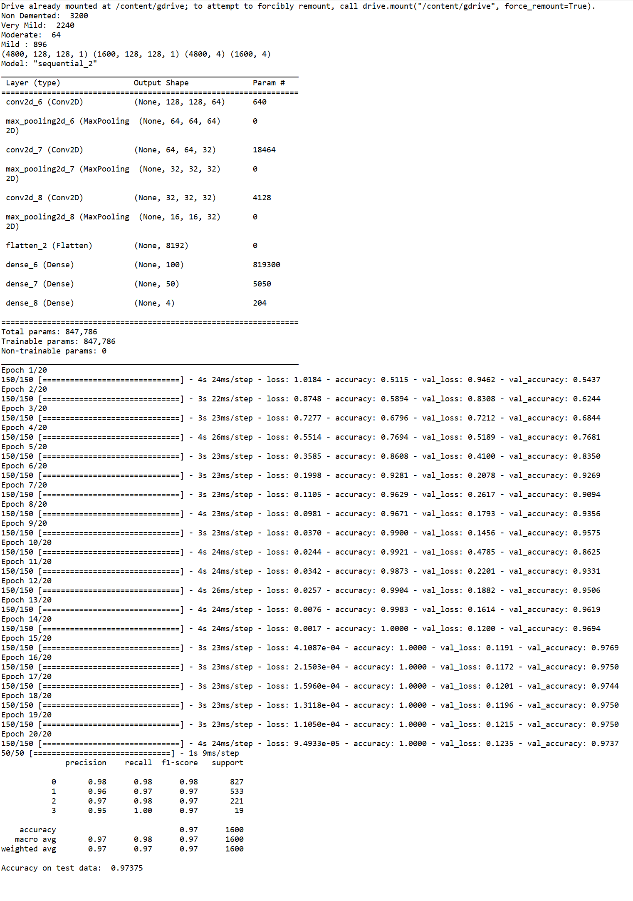
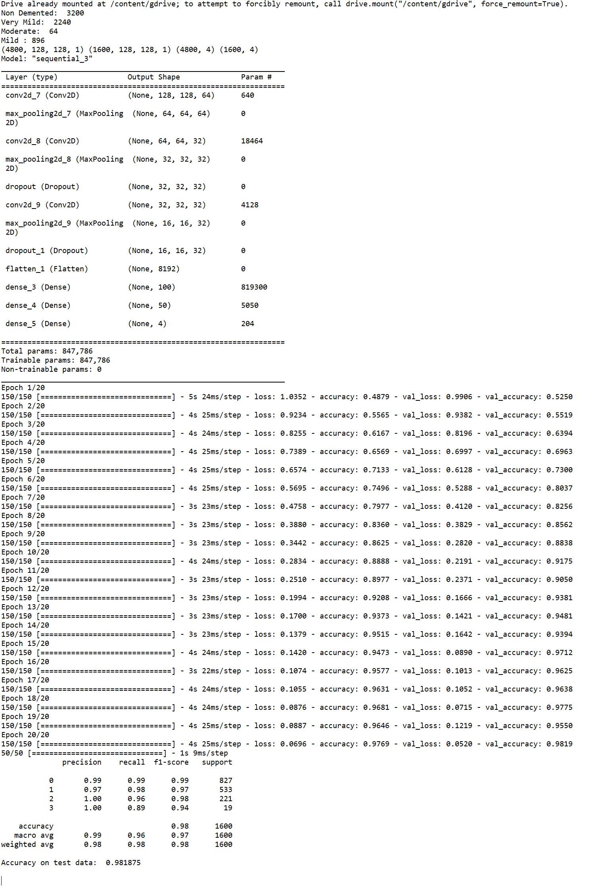
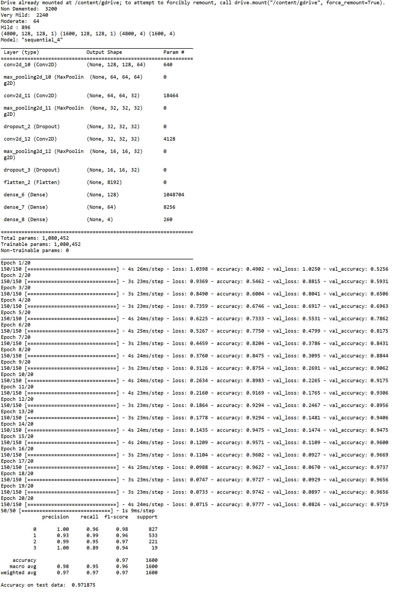

Abdullah Agah KANAT Jan, 2023

<h1 align="center"><strong>ALZHEIMER DIAGNOSING WITH DEEP LEARNING</strong></h1> 
<h2 align="center" ><strong>Abstract</strong></h2>
The aim of this study is to diagnose Alzheimer's using convolutional neural network from brain MRI images. In this study, there will be some previous studies on this subject and the results of these studies. We will process the effects of the studies and compare them with our own study. We want to test and see if we can get better results from existing uses.
  

# **1. INTRODUCTION**
According to some studies, there are approximately 400 thousand detected Alzheimer's patients in Turkey. And this number is estimated to be about 1 million, including the undetected ones. It seems that there is a correct ratio between the lifespan of a human being and the rate of Alzheimer's.

The population over the age of 65, which currently makes up 8.7% of the total population of Turkey, is increasing rapidly. On the other hand, other age groups do not show an increase in this rate. For this reason, a rapid increase is observed in the number of dementia patients. Currently, there are 47 million Alzheimer's patients in the world and it is expected that there will be 76 million in 2030 and 135.5 million in 2050. In Turkey, 600,000 families are struggling with this disease. Every 3 seconds, 1 person becomes dementia. [1].

Early diagnosis is possible for a patient who go to the health center with the complaint of forgetfulness. Studies on Alzheimer have been around for last 50 years. Our aim in this matter is whether we can get a good result in the diagnosis of Alzheimer's with brain MRI images and whether we can get a better result than existing studies. When we look at most studies in the diagnosis of Alzheimer's, we see that additional data are used for precise results. Because for doctors, the analyzes made from MR images alone may be insufficient for the desired success. However, with the development of technology and new methods in the field of computers, we can now interpret the data much better than humans can and detect the relationships between the data. In Alzheimer's studies, we often see that Data Mining is used to classify data and Convolutional Neural Networks architecture is used to perform the study. However, in some studies, it is possible to encounter methods and technologies such as VGG, IN, CoT, KNN, ST, EWT, DWT, CuT CWT and DTCWT. In studies in this area, we see that data obtained from OASIS and ADNI are generally used as data sets. In this study, we will use the images that we will obtain from ADNI.

## **1.1 Residual and Plain Convolutional Neural Networks in 3D Brain MRI Classification**
In the study, at the 14th International Symposium on Biomedical Imaging, using residual and flat convolutional neural networks for 3D brain MRI classification, remarkable progress has been made in diagnosing Alzheimer's from various aspects. While feature extraction steps were avoided in this investigation, similar performance was obtained, unlike feature extraction procedures that are required for similar studies. The studies made use of information from the Alzheimer's Disease Neuroimaging Initiative (ADNI). To avoid information leaks, not all data is shared. The dataset includes of 231 images of 4 classes and 110x110x110 3D MRI brain scans, of which 50 are associated with Alzheimer's disease, 43 are associated with late mild cognitive impairment, 77 are associated with early mild cognitive impairment, and 61 are associated with normal Cohorts. Data from VoxCNN and ResNet are 99 percent similar to one another. With a success rate of 89.08 percent in this investigation, Alzheimer's patient detection was accomplished [2].

## **1.2 Towards Alzheimer's disease classification through transfer learning**
In the Transfer Learning of Alzheimer's Disease Classification presentation at the 2017 International Conference on Bioinformatics and Biomedicine, it was said that cutting-edge architectures such as VGG16 and inception V4 would be sufficient to obtain a good result with a small number of MR images. Statistical machine learning methods such as the Support Vector Machine (SVM) have been used early to detect Alzheimer's disease and have had significant success. However, it has been observed that deep learning methods such as Convolutional Neural Networks (CNN), which have been used recently, perform better than statistical methods in detecting Alzheimer's disease. Since few MRI images were used in this study, the training data was chosen to provide the most information via image entropy. In this study, which aims to distinguish between AD and HC patients, the data set used in OASIS is comprised of brain MRI images of people aged between 18 and 96 years. A total of 200 people, 100 from the AD group and 100 from the HC group, were selected for the study. In the studies, the highest success was the study with Inception V4 with 96.25 percent. It was observed that VGG16 performed lower than expected when trained from scratch [3].
## **1.3 Early Diagnosis of Alzheimer's Disease: A Neuroimaging Study with Deep Learning Architectures**
A deep convolutional neural network is suggested in the study Early diagnosis of Alzheimer's disease: A neuroimaging investigation with deep learning architectures, which was presented at the conference which is on the 2018 Computer Vision and Pattern Recognition Workshops. The data used in this study, which used Inception V4 and ResNet, were once more acquired from the OASIS database. In this study, four different patient data types were used in the development of two fundamental deep CNNs, and Inception V4 and ResNet were both found to have severe disease categorization inadequacies. With the help of this investigation, we were able to identify one patient without Alzheimer's with an accuracy of 90% using ResNet and an accuracy of 86.5% using Inception V4. The recommended accuracy for the same group is 99 percent, according to OASIS statistics [4].

## **1.4 3D Deep Convolutional Network for Alzheimer's Disease Diagnosis**
In the study, at the 2018 15th International Symposium on Biomedical Imaging, using a 3D deep convolutional network for Alzheimer's disease diagnosis using MR images, it is proposed to use an efficient and simple 3D convolutional network (3DConvNet) architecture that can provide high performance for AD detection. The ADNI dataset, which contained 1198 MRI brain images from 340 subjects, was used in a number of extremely effective experiments. It has contributed one of the best achievements to the literature with 98.74 percent test accuracy, 100% AD detection rate, and 2.4 percent false alarm [5].

## **1.5 Automatic Alzheimer's disease identification from brain MRI images**
Automatic Alzheimer's disease identification from brain MRI images: a study utilizing several feature extraction methods. The study's objective was to create a computer-aided brain diagnostic (CABD) tool that could assess whether an Alzheimer's brain scan revealed any symptoms. This study employed a number of activities, including filtering, feature extraction, Student's t-test based feature selection, and K-Nearest Neighbor (KNN) based classification. The ST+KNN method was used to create this study, which contributes to the body of knowledge by showing that the Sharlet Transform feature extraction methodology produces better outcomes for the diagnosis of Alzheimer's. The data used in this study, which was built using local clinical data, consists of 165 visual records from 23 individuals. Precision and Specificity were both 100% successful in this trial [6].

Table 1 - Studies on deep learning for Alzheimer's diagnosis

|***Study***|**Author and Year**|**Issue/Problem**|**Datasets**|**Methods**|**Performance**|
| :-: | :-: | :-: | :-: | :-: | :-: |
|*Residual and Plain Convolutional Neural Networks for 3D Brain MRI Classification [2]*|Sergey Korolev, 2017|To show how higher performance can be achieved skipping the feature extraction steps with the residual and plain 3D convolutional neural network architectures.|ADNI|
VoxCNN (for AD vs NC)

ResNet (for AD vs NC)
|
%88.08

%87.07
|
|
*Towards Alzheimer's disease classification through transfer learning [3]*

|Marcia Hon, 2017|To attempt solving the issues with transfer learning, where state-of-the-art architectures such as VGG and Inception are initialized with pre-trained weights from large benchmark datasets consisting of natural images, and the fully connected layer is re-trained with only a small number of MRI images.|OASIS|
VGG16 (transfer learning)

Inception V4 (transfer learning)
|
%92.3

%96.25
|
|*Early Diagnosis of Alzheimer's Disease: A Neuroimaging Study with Deep Learning Architectures [4]*|Jyoti Islam, 2018|To use a deep convolutional neural network for Alzheimer's Disease diagnosis using brain MRI data analysis.|OASIS|
Inception V4 (for non-demented)

ResNet (for non-demented)
|
%86

%90
|
|
*An efficient 3D deep convolutional network for Alzheimer's disease diagnosis using MR images [5]*

|Karl Bäckström,2018|In the diagnosis of Alzheimer's disease with MRI brain images, 1- to propose a novel and effective 3D ConvNet architecture; 2-to study the impact of hyper-parameter selection on the performance of AD classification; 3- to study the impact of pre-processing; 4-to study the impact of data partitioning; 5- to study the impact of dataset size.|ADNI|
DeepAD (for AD vs NC)

SAE-CNN (for AD vs NC)

3D-AE-CNN (for AD vs NC)

AE (for AD vs NC)

SAE (for AD vs NC)

ICA (for AD vs NC)

MIL (for AD vs NC)
|
%98.84

%95.39

%87.60

%87.76

%94.74

%85.80

%88.80
|
|
*Automated Detection of Alzheimer’s Disease Using Brain MRI Images– A Study with Various Feature Extraction Techniques [6]*

|U. Rajendra Acharya, 2019|To develop a Computer-Aided-Brain-Diagnosis (CABD) system that can determine if a brain scan shows signs of Alzheimer's disease.|LOCAL|
CoT + KNN

CuT + KNN

CWT + KNN

DTCWT + KNN

DWT + KNN

EWT + KNN

ST + KNN
|
%82.35

%87.18

%63.57

%93.10

%84.75

%53.54

%92.17

|

# **2. The Developed Approach**
The aim of this study is to use CNN in the diagnosis of Alzheimer's and to get a good result. Colorless 2D MR images, color 2D MR images and 3D MR images are used in such studies. Generally used data are 3D MR images. 2D colorless MRI images, on the other hand, have very low efficiency. However, using 3D MRI images takes longer and costs more. We were planning to use color 2D MR images in this study, but we had to use colorless versions because we could not reach colored 2D datasets. However, we believe that 2D data will be more useful and will provide at least as much efficiency as 3D MR images. So in parallel with this belief we will use ConvNet. However, we will usually use the Pooling Layer to reduce the number of calculations and get faster results. There are many layers that can be used when working with CNN, such as convolutional layers and dropout layers, depending on the purpose. According to the work done, we will also see the use of Flatten and Dense. In these experiments we will do, we will compare the Accuracy, F1-Score, Recall and Precision values. We will use a dataset from the ADNI database as the dataset. There are 6400 MR images in this dataset and they are in 4 different classes. These classes are readily available and also Data Mining methods will not be used to classify them. All MRI images are 128x128 pixels, with classes Mild Dementia (896 MRI images), Moderate Dementia (64 MRI images), No Dementia (3200 MRI images), and Very Mild Dementia (2240 MRI images). We will test these studies on the Colab platform. Details of the studies and images from Colab are available in the next parts of the study.

<image src="Images/ADNI_AlzheimersMRIbrainDataset.png" width="100%">

*Figure 1 - ADNI Alzheimer's MRI Brain Images Dataset*

# **3. EXPERİMENTAL WORKS**
In this study, we will explain the experiments we have done and the results of the changes under this title. We used Colab Platform by transferring 6400 MRI images to google drive account and pulling these data from Drive. Actually, we wanted to do these operations locally from the computer instead of Colab, but with the latest update of the TensorFlow library, we preferred to use the Colab platform because the use of the graphics card on the computer became quite complicated. We used many libraries. In all our experiments, we exposed our training data to the network 20 times.

*Figure 2 - Samples of 2D Colourless MRI Images from ADNI Dataset*

## **3.1 Experiment 1**
In our first experiment, we used the Conv2D layer. Then we used the Max Pooling layer. We repeated these two applications 3 times in total. During this iteration, we used 64 convolution nodes in the first Conv2D layer and 32 in the second and third. Then we added the Flatten's layer, thus increasing the speed of the data going to the input of the last layer. Then we added the Dense layer, one with 100 nodes and the other with 50 nodes. We completed our model by applying SoftMax with 4 nodes in the last Dense layer. We see that over-learning occurs when we train our model when we come to 14th epoch. And in the other epochs which are after 14th, we see the loss getting too high. Still, we achieved an accuracy rate of 97.38% in our first experiment.

*Figure 3 - Results of the First Experiment*

## **3.2 Experiment 2**
In our second experiment, we added two Dropout layers, the first 0.20 and the second 0.25, after our second and third Conv2D-Max Pooling pair to avoid over-learning. We did not encounter any excessive learning and data loss. In this study, we obtained the accuracy value as 98.19%.

*Figure 4 - Results of the Second Experiment*
## **3.3 Experiment 3**
In our last experiment, we changed the number of convolution nodes. We changed the values from 64, 32, 32 to 16, 32, 64, respectively. We also changed the first Dense layer node numbers from 100, 50 to 128, 64, respectively. After the 17th Epoch, we detected a negative deviation in our accuracy value and achieved an accuracy rate of 97.19%.

*Figure 5 - Results of the Third Experiment*

# **4. CONCLUSIONS**
In this study, we saw examples of how CNN was used and we tested our own work. Yes, maybe we didn't break new ground in this field, but I think we achieved a very good result compared to similar studies. In previous similar studies, the highest success rate was 98.84%, and was from the study with DeepAd using the 3D ADNI datasets included in the study in 1.4. And with the 98.19% accuracy rate we achieved with our experiment in 3.2 from the experiments we have done, we can be the second in the success ranking of the studies we have done literature study. On the other hand, we see that the use of Dropout not only prevents excessive learning, but also affects the success rate. 3. With the changes we made in the experiment, we did it by wondering about the results of the increasing number of nodes entering the layers. We were not satisfied with the result we got. It was the experiment where we had the lowest success rate. As a result, we proved that with the 2D colorless images and the model we created on the basis of Conv2D, very effective results can be achieved. With such studies, early detection of Alzheimer's can be accelerated in the future and a very efficient system for early intervention can be established. With the increase in Alzheimer's cases predicted in the following years and the creation of richer data sets, there is no reason why these success rates should not reach 100%.

Table 2 - Results of All Experiments in This Study

|**Experiments**|**Model**|**Layers**|**Precision**|**Recall**|**F1-Score**|**Support**|**Accuracy Rate**|
| - | - | - | - | - | - | - | - |
|**Experiment-1**|CNN|
Conv2D

MaxPooling2D

Flatten

Dense
|0\.97|0\.98|0\.97|1600|0\.9738|
|**Experiment-2**|CNN|
Conv2D

MaxPooling2D

Flatten

Dense

Dropout
|0\.99|0\.96|0\.97|1600|0\.9819|
|**Experiment-3**|CNN|
Conv2D

MaxPooling2D

Flatten

Dense

Dropout
|0\.98|0\.95|0\.96|1600|0\.9719|

# **5. REFERENCES**
[1] “Türkiye’de 600.000 aile Alzheimer hastalığı ile mücadele ediyor”, alzheimerdernegi.org.tr. <https://www.alzheimerdernegi.org.tr/turkiyede-600-000-aile-alzheimer-hastaligi-ile-mucadele-ediyor/> (accessed Dec. 20, 2022)

[2] S. Korolev, A. Safiullin, M. Belyaev and Y. Dodonova, "Residual and plain convolutional neural networks for 3D brain MRI classification," 2017 IEEE 14th International Symposium on Biomedical Imaging (ISBI 2017), 2017, pp. 835-838, doi: 10.1109/ISBI.2017.7950647.

[3] M. Hon, Towards Alzheimer's Disease Classification Through Transfer Learning. <https://ieeexplore.ieee.org/stamp/stamp.jsp?tp=&arnumber=8217822> (accessed Dec. 14, 2022)

[4] Jyoti Islam, Early Diagnosis of Alzheimer's Disease: A Neuroimaging Study With Deep Learning Architectures. <https://openaccess.thecvf.com/content_cvpr_2018_workshops/w36/html/Islam_Early_Diagnosis_of_CVPR_2018_paper.html> (accessed Dec. 14, 2022)

[5] K. Bäckström, M. Nazari, I. Y. -H. Gu and A. S. Jakola, "An efficient 3D deep convolutional network for Alzheimer's disease diagnosis using MR images," *2018 IEEE 15th International Symposium on Biomedical Imaging (ISBI 2018)*, 2018, pp. 149-153, doi: 10.1109/ISBI.2018.8363543.

[6] Acharya, U.R., Fernandes, S.L., WeiKoh, J.E. *et al.* Automated Detection of Alzheimer’s Disease Using Brain MRI Images– A Study with Various Feature Extraction Techniques. *J Med Syst* *43*, 302 (2019). https://doi.org/10.1007/s10916-019-1428-9

